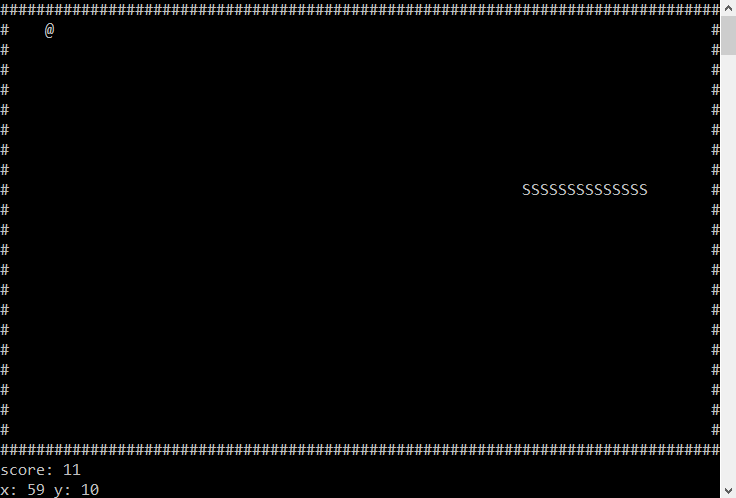

Portable snake game written in c for terminal/winconsole with scaleable resolution
===

The game uses my simple cursor manipulation library and scales with terminal resolution.  
requires [jlib](https://github.com/jarekt/jlib) - download it manually or run the getjlib python script

## How to run
### Precompiled Executables
- you can get a precompiled binary(executable) file for your system in the releases tab
### Manual compilation
- **linux**: cd into the downloaded repo folder and type: *gcc src/snake.c jlib/src/linux.c -o snake*
- **windows**: install microsoft visual studio and add ***snake.c jlib.h and windows.c*** to your project, then build
### Cmake
- coming in v1.1!

## Demo pictures

* works with different resolutions

* low res example running in [cool retro term](https://github.com/Swordfish90/cool-retro-term)

* works even on windows !

## Known problems
- the speed increase value (when snake eats food) should be changed to a more fun value (this can be edited in the detect collision function)
